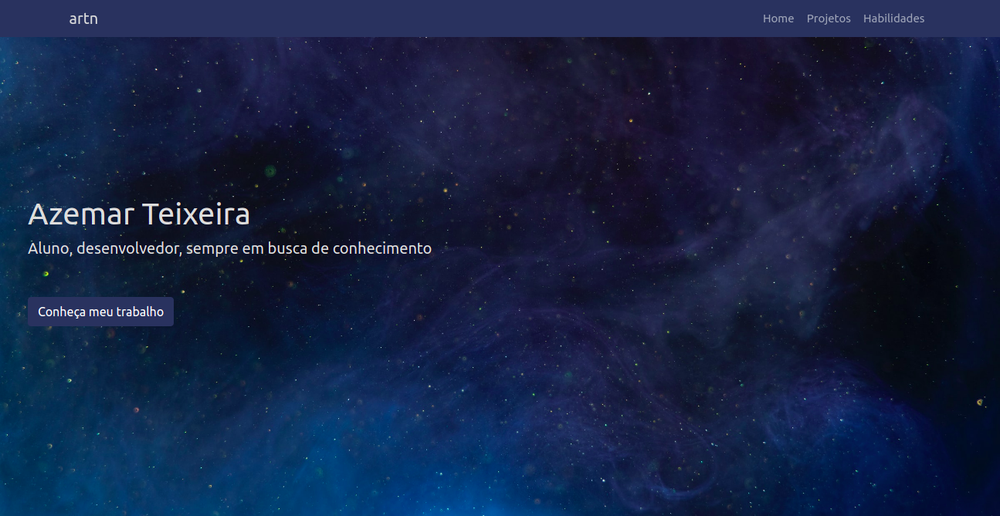

Meu website pessoal

## Feito com

- Typescript - Linguagem de programação baseada em Javascript
- Next.js - Framework para desenvolvimento com React.js
- Bootstrap - Framework de CSS para desenvolvimento de sites responsivos
- SASS - Extensão de CSS, usada para customizar o Bootstrap
